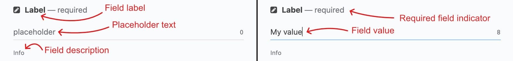
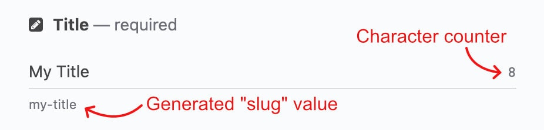
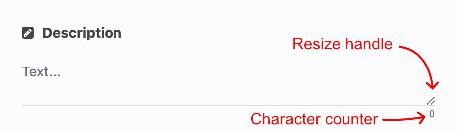
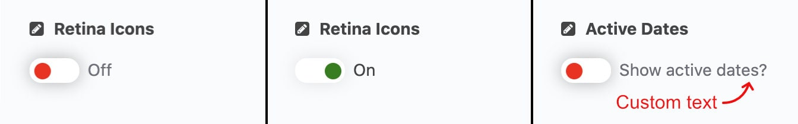
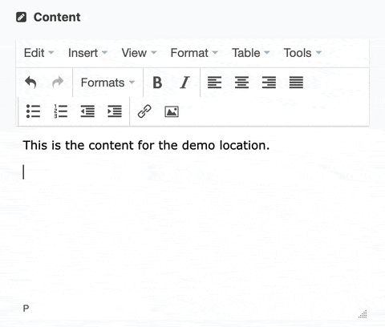

<h1>Fieldtypes</h1>

> The Interactive River CMS uses several different fieldtypes to help gather and format data for the client application.

- [Plain text](#plain-text)
- [Number](#number)
- [Toggle](#toggle)
- [Rich text](#rich-text)
- [Location](#location)
- [Asset](#asset)
- [Repeater](#repeater)

<figure align="center">

<figcaption><em>Anatomy of a field.</em></figcaption>
</figure>

---
 

## Plain text

Plain text fields are used for simple text data and come in two different variants: single- and multi-line.

The single-line text field can be used to auto generate a "sluggified" version of the contents for use in URLs.

For larger values, the multi-line text field can be resized by clicking and dragging on the resize handle.

<figure align="center">

<figcaption><em>A single-line plain text field.</em></figcaption>
</figure>

<figure align="center">

<figcaption><em>A multi-line plain text field</em></figcaption>
</figure>

---
 

## Number

---
 

## Toggle

Toggle fields are used for boolean (true/false) data. 

By default, the field has either an "On" or "Off" label next to the switch, but can be configured to show a custom text label instead.

<figure align="center">

<figcaption><em>Examples of the toggle field in its <code>Off</code> and <code>On</code> states, as well with a custom label.</em></figcaption>
</figure>

---
 

## Rich text

The rich text field allows you to easily create styled and properly formatted HTML content, with an experience similar to a word-processor.

<figure align="center">

<figcaption><em>Using the rich text field to create a styled blockquote.</em></figcaption>
</figure>

<aside>
This is some aside text

</aside>

> **NOTE**:
> 
> sdfgsdgfgsdf

---
 

## Location

---
 

## Asset

---
 

## Repeater