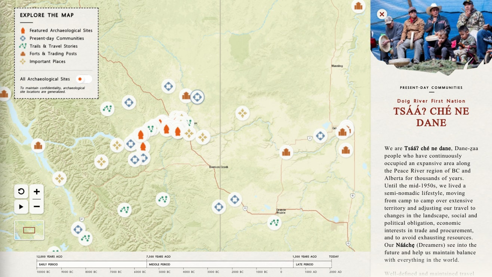
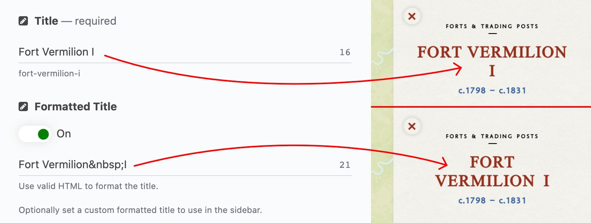
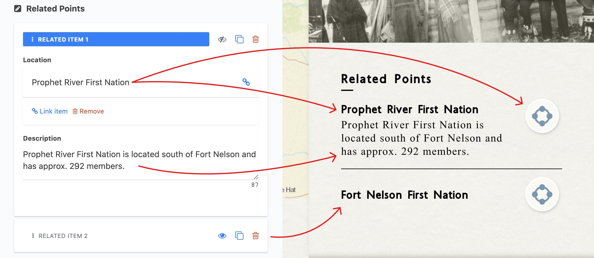

<h1>Locations</h1>

> Locations are the main data element in the Interactive River digital experience. 

Each Location will show on the map as a marker which, when clicked, will open a sidebar to display the full content of the Location. Along with information about the site and it's history, a Location may be accompanied by multimedia attachments such as image and artifact galleries, audio recordings, and videos. Each Location may also include links to other related Locations.

<figure align="center">

<figcaption><em></em></figcaption>
</figure>

<h2>Data Entry</h2>

- [Title](#title)
- [Formatted Title](#formatted-title)
- [Subtitle](#subtitle)
- [Category](#category)
- [Borden Number](#borden-number)
- [Content](#content)
- [Location](#location)
- [Active Dates](#active-dates)
	- [Show dates](#show-dates)
	- [Preset Period(s)](#preset-periods)
	- [Custom Date Range](#custom-date-range)
	- [Custom Range Display](#custom-range-display)
- [Featured Image](#featured-image)
- [Gallery](#gallery)
- [Artifacts](#artifacts)
- [Audio](#audio)
- [Video](#video)
- [Related Points](#related-points)

### Title

| Input Type | Required |
| ---------- | -------- |
| plain text | yes      |

`Title` is a required field, along with `Location` & `Category`.

<figure align="center">

</figure>

---
 

### Formatted Title

| Sub-field   | Input Type | Required |
| ----------- | ---------- | -------- |
| `On/Off`    | toggle     | no       |
| `HTML text` | plain text | no       |

Along with the `Title`, there is an optional `Formatted Title` for advanced users. This field allows you to directly enter the exact HTML for the title in the sidebar.

- If either the toggle is "Off" or the HTML text field is empty, the unformatted plain text `Title` will be used instead.
- `Formatted Title` is only used in the header of the sidebar, any other occurrences of the location's title will use the unformatted plain text `Title`.

<figure align="center">

</figure>

---
 

### Subtitle

| Input Type | Required |
| ---------- | -------- |
| plain text | no       |

An optional subtitle.

> **NOTE**: The location subtitle actually appears above the title.

<figure align="center">

</figure>

---
 

### Category

| Input Type   | Required |
| ------------ | -------- |
| linked entry | yes      |

Pick from one of the five available categories.

As well as determining the location's icon on the map, the selected category's title is displayed above the location title.

`Category` is a required field, along with `Title` & `Location`.

> **NOTE**: When a category has been selected, clicking the link icon next to the category's title will open the page to edit the selected category. To switch categories, click the "Link item" button below the category's title (see image below).

<figure align="center">

</figure>

---
 

### Borden Number

| Input Type | Required |
| ---------- | -------- |
| plain text | no       |

For archaeological sites, enter the site's Borden Number.

This data is not actually displayed anywhere in the client app, but does allow editors to search for locations by Borden Number.

<figure align="center">

</figure>

---
 

### Content

| Input Type | Required |
| ---------- | -------- |
| rich text  | no       |

Body content for the location sidebar.

> **NOTE**: Some older entries may appear to have a larger font-size for the first paragraph when viewing in the rich-text editor. This is leftover from an earlier design and can be ignored.

<figure align="center">

</figure>

Many of the locations have a specially formatted blockquote. To use this quote format:

1. Write out both the quote and source in separate paragraphs.
2. Apply blockquote formatting by selecting both quote and source, then opening the editor's "Formats" dropdown menu and selecting "Blockquote"
3. If the quote is attributed, select the attribution and this time select "Blockquote Citation" from the "Formats" dropdown menu.

<figure align="center">

<figcaption><em>Using the rich text field to create a styled blockquote.</em></figcaption>
</figure>

---
 

### Location

| Input Type | Required |
| ---------- | -------- |
| location   | yes      |

The `Location` is a required field, along with `Title` & `Category`. Enter a street address or city name, latitude & longitude coordinates, or drag the marker to the desired location.

<figure align="center">

<figcaption><em>Manually repositioning the location marker.</em></figcaption>
</figure>

> **NOTE**: Editors manually typing in coordinates will run into problems with an over-aggressive autocomplete for coordinates. It is highly recommended to copy-and-paste in properly formatted coordinates

---
 

### Active Dates

A location's date period/range will show in the sidebar as well highlight a section of the timeline.

There are a number of fields associated with setting & configuring the dates for a given location:

- [`Show dates`](#show-dates)
- [`Preset Period(s)`](#preset-periods)
- [`Custom Date Range`](#custom-date-range)
- [`Custom Range Display`](#custom-range-display)

#### Show dates

| Input Type | Required |
| ---------- | -------- |
| toggle     | no       |

Whether to show the location date in the sidebar & timeline of the client app. Also controls whether the other date fields are shown in the editor.

<figure align="center">

</figure>

 

#### Preset Period(s)

| Input Type   | Required |
| ------------ | -------- |
| linked entry | no       |

Pick from one of the six combinations of the preset date periods.

If one of the date periods is selected, any custom date display data will be ignored.

> **NOTE**: When a date period has been selected, clicking the link icon next to the period's title will open the page to edit the selected period. To switch periods, click the "Link item" button below the period's title (see image below).  

> **NOTE**: Only users with **ADMIN** privileges can save changes to the Date Period entries.

See also: [`Custom Date Range`](#custom-date-range), [`Custom Range Display`](#custom-range-display)

<figure align="center">

</figure>

 

#### Custom Date Range

| Sub-field    | Input Type | Required |
| ------------ | ---------- | -------- |
| `Start Year` | number     | no       |
| `End Year`   | number     | no       |

Set a custom date range for this entry.

* The `Start Year` and `End Year` fields will dictate the highlighted section of the timeline, and will be displayed in the sidebar (unless the `Custom Range Display` is set).
* Use negative numbers for years BCE (before year 0). Must be between -10000 and 2020. If either field is left blank, it will default to 0. For a single year, enter that same year as both start and end years.
* If `Preset Period(s)` is set, this data will be ignored.

See also: [`Custom Range Display`](#custom-range-display), [`Preset Period(s)`](#preset-periods)

<figure align="center">

</figure>

 

#### Custom Range Display

| Input Type | Required |
| ---------- | -------- |
| plain text | no       |

Set custom date text in the sidebar for this entry.

* Overrides the auto-generated text from `Custom Date Range`.
* If `Preset Period(s)` is set, this data will be ignored.

See also: [`Custom Date Range`](#custom-date-range), [`Preset Period(s)`](#preset-periods)

<figure align="center">

</figure>

---
 

### Featured Image

| Input Type  | Required |
| ----------- | -------- |
| image asset | no       |

Set a featured header image for the sidebar. 

* Images should be 425x295 pixel JPEGs or PNGs.
* Images larger than 425x295 and/or with a different aspect ratio will be resized and cropped to fit.
* A decorative cutout is applied to the bottom edge of the image, so make sure there is no crucial information in the bottom corners of the image.

<figure align="center">

</figure>

---
 

### Gallery

| Input Type | Required |
| ---------- | -------- |
| repeater   | no       |

The `Gallery` is a repeater field, allowing the selection and configuration of multiple gallery items. Items are visible as a preview slideshow of thumbnails in the sidebar which - when clicked - opens a fullscreen image gallery view, allowing users to navigate through the full gallery.

<figure align="center">

</figure>

Each `Gallery` item has the following fields:

| Sub-field       | Input Type  | Required |
| --------------- | ----------- | -------- |
| `Image File`    | image asset | yes      |
| `Title/Caption` | plain text  | no       |
| `Attribution`   | plain text  | no       |

`Image File` is the full-size image for the gallery item. 

* Most images should ideally be between 1280x720 and 1920x1080 pixels. 
* The gallery view allows for zooming and panning very large images (eg. 1920x1080 pixels and larger), but be mindful that larger image files will take longer to download and load when using the client app. 
* A 425x200 pixel thumbnail will be automatically generated for the sidebar.

`Title/Caption` and `Attribution` are simple text fields, and are only visible in the gallery view.

<figure align="center">

</figure>

---
 

### Artifacts

| Input Type | Required |
| ---------- | -------- |
| repeater   | no       |

`Artifacts` is a repeater field for a gallery of artifacts, allowing the selection and configuration of multiple artifact gallery items. Items are visible as a preview slideshow of thumbnails in the sidebar which - when clicked - opens a fullscreen image gallery view, allowing users to navigate through the full gallery.

Each `Artifacts` item has the following fields:

| Sub-field     | Input Type  | Required |
| ------------- | ----------- | -------- |
| `Image`       | image asset | yes      |
| `Title`       | plain text  | no       |
| `Description` | plain text  | no       |

`Image` is the full-size image for the gallery item. 

Much like the `Gallery`:

* Most images should ideally be between 1280x720 and 1920x1080 pixels. 
* The gallery view allows for zooming and panning very large images (eg. 1920x1080 pixels and larger), but be mindful that larger image files will take longer to download and load when using the client app. 
* A 425x200 pixel thumbnail will be automatically generated for the sidebar.

Unlike the `Gallery`:

* The `Artifacts` gallery view has a white background instead of black, and artifact images are expected to have either white or tranparent backgrounds.

`Title` and `Description` are simple text fields, and are only visible in the gallery view.

<figure align="center">

</figure>

---
 

### Audio

| Input Type | Required |
| ---------- | -------- |
| repeater   | no       |

`Audio` is a repeater field for attaching audio recordings to a location. Unlike `Gallery` and `Artifacts`, `Audio` items are not aggregated in the sidebar; instead each item shows its title, attribution, and thumbnail in the sidebar. When clicked, an audio player will open at the top of the sidebar and begin playing the audio file.

Each `Audio` item has the following fields:

| Sub-field     | Input Type  | Required |
| ------------- | ----------- | -------- |
| `Audio File`  | audio asset | yes      |
| `Thumbnail`   | image asset | yes      |
| `Title`       | plain text  | no       |
| `Attribution` | plain text  | no       |

`Audio File` is the actual audio file of the item. MP3 is the preferred format for balancing quality and file size. Audio items that do not have an audio file will be ignored.

`Thumbnail` is a 425x200 pixel image that shows in the sidebar. If the image supplied has different dimensions, it will be cropped and scaled to fit.

`Title` shows in the sidebar as well as the audio player. If `Title` is omitted, the filename of the `Audio File` will be used instead.

`Attribution` is only displayed in the sidebar view.

---
 

### Video

| Input Type | Required |
| ---------- | -------- |
| repeater   | no       |

`Video` is a repeater field for attaching video recordings to a location. Like `Audio`, `Video` items are not aggregated in the sidebar; instead each item shows its title, attribution, and thumbnail in the sidebar. When clicked, a fullscreen video player will begin playing the video file.

Each `Video` item has the following fields:

| Sub-field     | Input Type  | Required |
| ------------- | ----------- | -------- |
| `Video File`  | video asset | yes      |
| `Thumbnail`   | image asset | yes      |
| `Title`       | plain text  | no       |
| `Attribution` | plain text  | no       |

`Video File` is the actual video file of the item. MP4 is the preferred format for balancing quality and file size, and should aim to be 1280x720 pixels (720p). Video items that do not have an video file will be ignored.

`Thumbnail` is a 425x200 pixel image that shows in the sidebar. If the image supplied has different dimensions, it will be cropped and scaled to fit.

`Title` and `Attribution` are only displayed in the sidebar view. If `Title` is omitted, the filename of the `Video File` will be used instead.

---
 

### Related Points

| Input Type | Required |
| ---------- | -------- |
| repeater   | no       |

`Related Points` is a repeater field for related locations. Each related location will show its title and associated category icon, along with an optional (but recommended) description of the relationship between the two locations. When the icon is clicked, the map will recenter on the related location, and that location's marker will start a highlight animation.

Each `Related Points` item has the following fields:

| Sub-field     | Input Type   | Required |
| ------------- | ------------ | -------- |
| `Location`    | linked entry | yes      |
| `Description` | plain text   | no       |

`Location` is a link to the related Location in the CMS database.

`Description` will show beneath the Location's title in the sidebar.

<figure align="center">

</figure>

---
 
