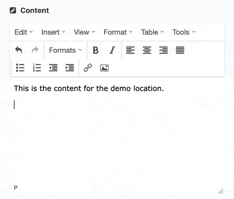
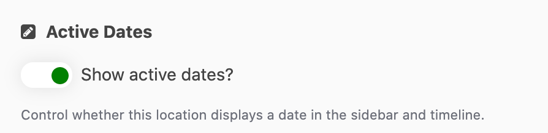

# Locations

> intro

## Data Entry

[link](#preset-periods)

### Title

| Input Type | Required |
| ---------- | -------- |
| Plain text | yes      |

> The title is a required field, along with location & category.

---
 

### Subtitle

| Input Type | Required |
| ---------- | -------- |
| Plain text | no       |

An optional subtitle.

> The location subtitle actually appears above the title.

---
 

### Category

| Input Type   | Required |
| ------------ | -------- |
| Linked entry | yes      |

Pick from one of the five available categories.

As well as determining the location's icon on the map, the selected category's title is displayed above the location title.

The category is a required field, along with title & location.

> When a category has been selected, clicking the link icon next to the category's title will open the page to edit the selected category. To switch categories, click the "Link item" button below the category's title (see image below).

---
 

### Borden Number

| Input Type | Required |
| ---------- | -------- |
| Plain text | no       |

For archaeological sites, enter the site's Borden Number.

> This data is not actually displayed anywhere in the client app, but does allow editors to search for locations by Borden Number.

---
 

### Content

| Input Type | Required |
| ---------- | -------- |
| Rich text  | no       |

Body content for the location sidebar. 

> Some older entries may appear to have a larger font-size for the first paragraph when viewing in the rich-text editor. This is leftover from an earlier design and can be ignored.

Many of the locations have a specially formatted blockquote. To use this quote format:

1. Write out both the quote and source in separate paragraphs.
2. Apply blockquote formatting by selecting both quote and source, then opening the editor's "Formats" dropdown menu and selecting "Blockquote"
3. If the quote is attributed, select the attribution and this time select "Blockquote Citation" from the "Formats" dropdown menu.

---
 

### Location

| Input Type | Required |
| ---------- | -------- |
| Location   | yes      |

The location is a required field, along with title & category. Enter a street address or city name, latitude & longitude coordinates, or drag the marker to the desired location.

> Editors manually typing in coordinates will run into problems with an over-aggressive autocomplete for coordinates. It is highly recommended to copy-and-paste in properly formatted coordinates

---
 

### Active Dates

There are a number of fields associated with setting & configuring the dates for a given location.

A location's date period/range will show in the sidebar as well highlight a section of the timeline.

#### Show dates

| Input Type | Required |
| ---------- | -------- |
| Toggle     | no       |

Whether to show the location date in the sidebar & timeline of the client app. Also controls whether the other date fields are shown in the editor.

 

#### Preset Period(s)

| Input Type   | Required |
| ------------ | -------- |
| Linked entry | no       |

Pick from one of the six combinations of the preset date periods.

If one of the date periods is selected, any custom date display data will be ignored.

> When a date period has been selected, clicking the link icon next to the period's title will open the page to edit the selected period. To switch periods, click the "Link item" button below the period's title (see image below).  
> **NOTE**: Only users with `ADMIN` privileges can save changes to the Date Period entries.

 

#### Custom Date Range

| Sub-field  | Input Type | Required |
| ---------- | ---------- | -------- |
| Start Year | Number     | no       |
| End Year   | Number     | no       |

Set a custom date range for this entry.

The start- and end-year fields will dictate the highlighted section of the timeline, and will be displayed in the sidebar (unless the custom range display is set).

> Use negative numbers for years BCE (before year 0). Must be between -10000 and 2020. If either field is left blank, it will default to 0. For a single year, enter that same year as both start and end years.

 

#### Custom Range Display

| Input Type | Required |
| ---------- | -------- |
| Plain text | no       |

Set custom date text in the sidebar for this entry.

 

---