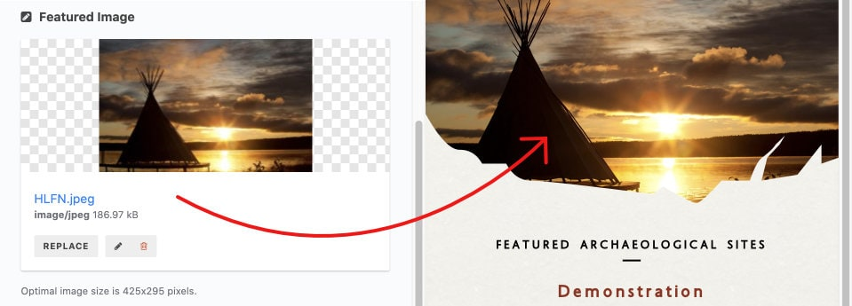

<h1>Locations</h1>

> Locations are the main data element in the Interactive River digital experience. 

Each Location will show on the map as a marker which, when clicked, will open a sidebar to display the full content of the Location. Along with information about the Location and it's history, a Location may be accompanied by multimedia attachments such as image and artifact galleries, audio recordings, and videos. Each Location may also include links to other related Locations.

<h2>Data Entry</h2>

- [Title](#title)
- [Formatted Title](#formatted-title)
- [Subtitle](#subtitle)
- [Category](#category)
- [Borden Number](#borden-number)
- [Content](#content)
- [Location](#location)
- [Active Dates](#active-dates)
	- [Show dates](#show-dates)
	- [Preset Period(s)](#preset-periods)
	- [Custom Date Range](#custom-date-range)
	- [Custom Range Display](#custom-range-display)
- [Featured Image](#featured-image)
- [Gallery](#gallery)
- [`Artifacts`](#artifacts)
- [Audio](#audio)

### Title

| Input Type | Required |
| ---------- | -------- |
| plain text | yes      |

> The Title is a required field, along with Location & Category.

---
 

### Formatted Title

| Sub-field | Input Type | Required |
| --------- | ---------- | -------- |
| On/Off    | toggle     | no       |
| HTML text | plain-text | no       |

Along with the Title, there is an optional Formatted Title for advanced users. This field allows you to directly enter the exact HTML for the title in the sidebar.

- If either the toggle is "Off" or the HTML text field is empty, the unformatted plain text Title will be used instead.
- Formatted Title is only used in the header of the sidebar, any other occurrences of the Location's title will use the unformatted plain text Title.

---
 

### Subtitle

| Input Type | Required |
| ---------- | -------- |
| plain text | no       |

An optional subtitle.

> The location subtitle actually appears above the title.

---
 

### Category

| Input Type   | Required |
| ------------ | -------- |
| linked entry | yes      |

Pick from one of the five available categories.

As well as determining the location's icon on the map, the selected category's title is displayed above the location title.

The category is a required field, along with title & location.

> When a category has been selected, clicking the link icon next to the category's title will open the page to edit the selected category. To switch categories, click the "Link item" button below the category's title (see image below).

---
 

### Borden Number

| Input Type | Required |
| ---------- | -------- |
| plain text | no       |

For archaeological sites, enter the site's Borden Number.

This data is not actually displayed anywhere in the client app, but does allow editors to search for locations by Borden Number.

---
 

### Content

| Input Type | Required |
| ---------- | -------- |
| rich text  | no       |

Body content for the location sidebar.

> Some older entries may appear to have a larger font-size for the first paragraph when viewing in the rich-text editor. This is leftover from an earlier design and can be ignored.

Many of the locations have a specially formatted blockquote. To use this quote format:

1. Write out both the quote and source in separate paragraphs.
2. Apply blockquote formatting by selecting both quote and source, then opening the editor's "Formats" dropdown menu and selecting "Blockquote"
3. If the quote is attributed, select the attribution and this time select "Blockquote Citation" from the "Formats" dropdown menu.

---
 

### Location

| Input Type | Required |
| ---------- | -------- |
| location   | yes      |

The location is a required field, along with title & category. Enter a street address or city name, latitude & longitude coordinates, or drag the marker to the desired location.

> Editors manually typing in coordinates will run into problems with an over-aggressive autocomplete for coordinates. It is highly recommended to copy-and-paste in properly formatted coordinates

---
 

### Active Dates

There are a number of fields associated with setting & configuring the dates for a given location.

A location's date period/range will show in the sidebar as well highlight a section of the timeline.

#### Show dates

| Input Type | Required |
| ---------- | -------- |
| toggle     | no       |

Whether to show the location date in the sidebar & timeline of the client app. Also controls whether the other date fields are shown in the editor.

 

#### Preset Period(s)

| Input Type   | Required |
| ------------ | -------- |
| linked entry | no       |

Pick from one of the six combinations of the preset date periods.

If one of the date periods is selected, any custom date display data will be ignored.

> When a date period has been selected, clicking the link icon next to the period's title will open the page to edit the selected period. To switch periods, click the "Link item" button below the period's title (see image below).  
> **NOTE**: Only users with `ADMIN` privileges can save changes to the Date Period entries.

 

#### Custom Date Range

| Sub-field  | Input Type | Required |
| ---------- | ---------- | -------- |
| Start Year | number     | no       |
| End Year   | number     | no       |

Set a custom date range for this entry.

* The start- and end-year fields will dictate the highlighted section of the timeline, and will be displayed in the sidebar (unless the custom range display is set).
* Use negative numbers for years BCE (before year 0). Must be between `-10000` and `2020`. If either field is left blank, it will default to `0`. For a single year, enter that same year as both start and end years.

 

#### Custom Range Display

| Input Type | Required |
| ---------- | -------- |
| plain text | no       |

Set custom date text in the sidebar for this entry.

---
 

### Featured Image

| Input Type  | Required |
| ----------- | -------- |
| image asset | no       |

Set a featured header image for the sidebar. 

* Images should be 425x295 pixel JPEGs or PNGs.
* Images larger than 425x295 and/or with a different aspect ratio will resized and cropped to fit.
* A decorative cutout is applied to the bottom edge of the image, so make sure there is no crucial information in the bottom corners of the image.

---
 

### Gallery

| Input Type | Required |
| ---------- | -------- |
| repeater   | no       |

The gallery is a repeater field, allowing the selection and configuration of multiple gallery items. Gallery items are visible as a thumbnail preview in the sidebar and in a fullscreen image gallery view, activated by clcking/tapping on the thumbnail preview.

Each gallery item has the following fields:

| Sub-field     | Input Type  | Required |
| ------------- | ----------- | -------- |
| Image File    | image asset | yes      |
| Title/Caption | plain text  | no       |
| Attribution   | plain text  | no       |

Image File is the full-size image for the gallery item. 

* Most images should ideally be between 1280x720 and 1920x1080 pixels. 
* The gallery view allows for zooming and panning very large images (eg. 1920x1080 pixels and larger), but be mindful that larger image files will take longer to download and load when using the client app. 
* A 425x200 pixel thumbnail will be automatically generated for the sidebar.

Title/Caption and Attribution are simple text fields, and are only visible in the gallery view.

---
 

### `Artifacts`

| Input Type | Required |
| ---------- | -------- |
| repeater   | no       |

`Artifacts` is a repeater field for a gallery of artifacts, allowing the selection and configuration of multiple artifact gallery items. Artifact items are visible as a thumbnail preview in the sidebar and in a fullscreen image gallery view, activated by clcking/tapping on the thumbnail preview.

Each artifact gallery item has the following fields:

| Sub-field   | Input Type  | Required |
| ----------- | ----------- | -------- |
| `Image`       | image asset | yes      |
| `Title`       | plain text  | no       |
| `Description` | plain text  | no       |

`Image` is the full-size image for the gallery item. 

Much like the `Gallery`:

* Most images should ideally be between 1280x720 and 1920x1080 pixels. 
* The gallery view allows for zooming and panning very large images (eg. 1920x1080 pixels and larger), but be mindful that larger image files will take longer to download and load when using the client app. 
* A 425x200 pixel thumbnail will be automatically generated for the sidebar.

Unlike the `Gallery`:

* The `Artifacts` gallery view has a white background instead of black, and artifact images are expected to have either white or tranparent backgrounds.

`Title` and `Description` are simple text fields, and are only visible in the gallery view.

---
 

### Audio

| Input Type | Required |
| ---------- | -------- |
| repeater   | no       |

Audio is a repeater field for a gallery of artifacts, allowing the selection and configuration of multiple artifact gallery items. Artifact items are visible as a thumbnail preview in the sidebar and in a fullscreen image gallery view, activated by clcking/tapping on the thumbnail preview.

Each artifact gallery item has the following fields:

| Sub-field   | Input Type  | Required |
| ----------- | ----------- | -------- |
| `Image`       | image asset | yes      |
| `Title`       | plain text  | no       |
| `Description` | plain text  | no       |

`Image` is the full-size image for the gallery item. 

Much like the `Gallery`:

* Most images should ideally be between 1280x720 and 1920x1080 pixels. 
* The gallery view allows for zooming and panning very large images (eg. 1920x1080 pixels and larger), but be mindful that larger image files will take longer to download and load when using the client app. 
* A 425x200 pixel thumbnail will be automatically generated for the sidebar.

Unlike the `Gallery`:

* The `Artifacts` gallery view has a white background instead of black, and artifact images are expected to have either white or tranparent backgrounds.

`Title` and `Description` are simple text fields, and are only visible in the gallery view.

---
 
